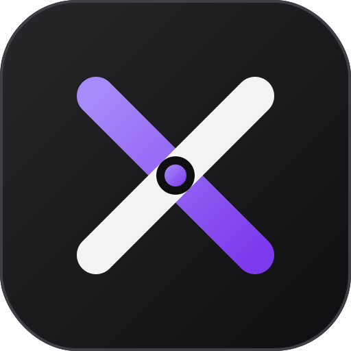
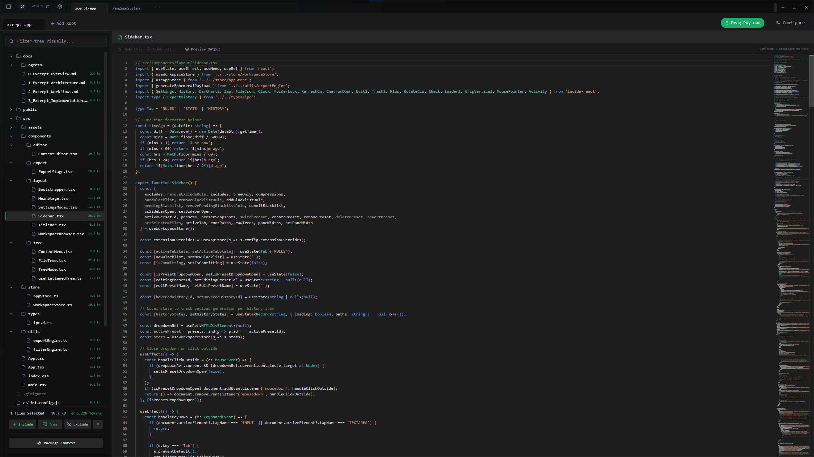
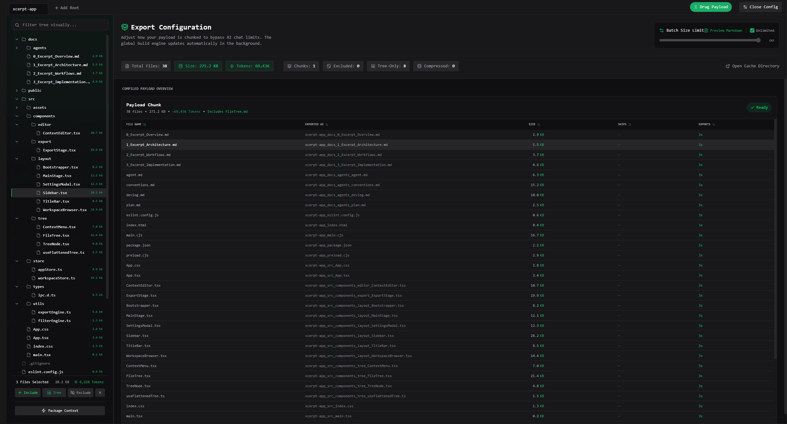
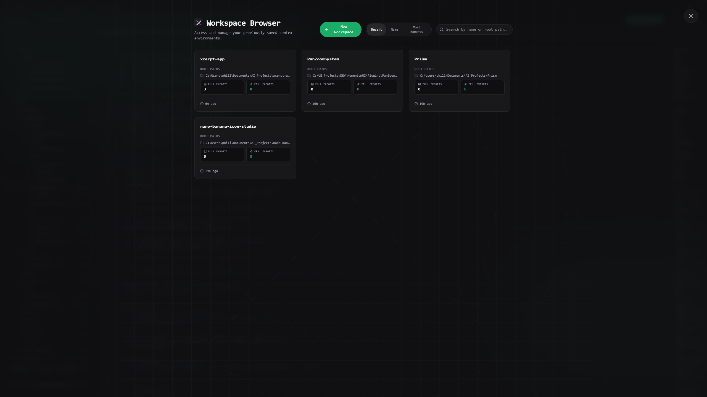
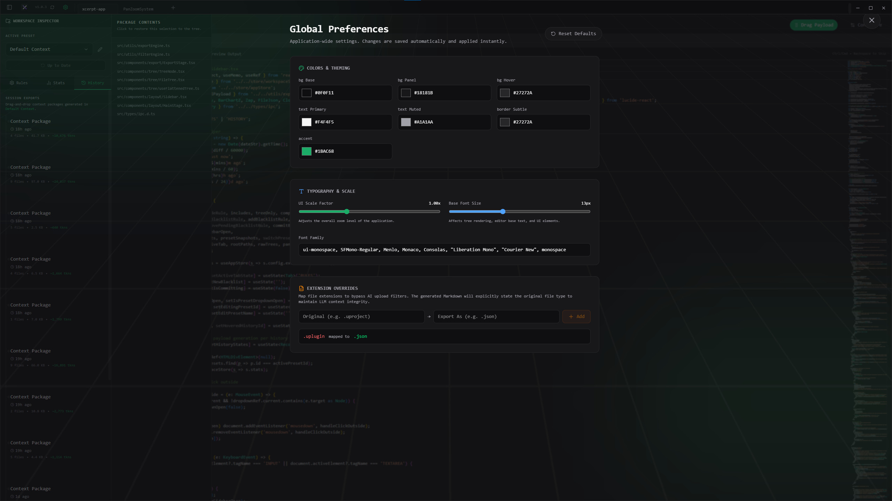

<div align="center">
  
  
  <h1>Xcerpt</h1>
  <p><b>A premium, desktop-based Context Staging IDE for AI workflows.</b></p>

  <a href="https://github.com/Stinger05189/xcerpt-app/releases/latest">
    
  </a>
  <a href="https://github.com/Stinger05189/xcerpt-app/blob/main/LICENSE">
    
  </a>
  <a href="https://buymeacoffee.com/philipquicz">
    
  </a>
</div>

<br/>

**Xcerpt** acts as an intelligent middle-layer between your codebase and your browser. It allows you to visually curate files, surgically "compress" large files using a built-in code editor, manage multiple independent presets within parallel workspaces, and seamlessly drag-and-drop optimized context payloads directly into AI chat interfaces (ChatGPT, Claude, Gemini, etc.).

---

## 📸 Interface Gallery

<table>
  <tr>
    <td width="50%">
      <b>The Main Stage & Compression Editor</b><br/>
      
    </td>
    <td width="50%">
      <b>Export Configuration & Chunking</b><br/>
      
    </td>
  </tr>
  <tr>
    <td width="50%">
      <b>Workspace Browser</b><br/>
      
    </td>
    <td width="50%">
      <b>Global Preferences & Theming</b><br/>
      
    </td>
  </tr>
</table>

---

## 🚀 Core Features

- **Frictionless LLM Integration:** Visually curate your context payload and drag the final optimized package straight into your browser.
- **Context Compression (Skip Blocks):** Save thousands of tokens and improve AI focus by highlighting and skipping unneeded code blocks while preserving structural boundaries.
- **Ephemeral Quick Exports:** Instantly estimate exact BPE token counts for specific tree selections and generate lightning-fast, process-bound temporary payloads.
- **Multi-Workspace & Presets:** Maintain multiple independent visual exclusion rules and compression states within the same codebase (e.g., "UI Bug Context" vs "Database Context").
- **AI Filter Bypassing:** Seamlessly bypass chat application file limits via Automated Chunking, and bypass arbitrary file-type rejections using Global Extension Overrides (e.g., map `.uproject` to `.json` on the fly).
- **Implicit Auto-Saving:** Open the app and start working immediately. Every session, tab, and UI state is automatically saved in the background.

## 📥 Installation

**[Download the latest release for Windows, Mac, or Linux here.](https://github.com/Stinger05189/xcerpt-app/releases/latest)**

_Note: Xcerpt features a seamless background auto-updater. Once installed, future updates will download automatically and prompt you to restart._

## 🛠️ Development & Build Setup

Xcerpt is built using Electron, React 18+, Vite, Zustand, and Tailwind CSS v4.

### Prerequisites

- [Node.js](https://nodejs.org/) (v18+ recommended)
- Git

### Local Setup

```bash
# Clone the repository
git clone https://github.com/Stinger05189/xcerpt-app.git

# Navigate into the directory
cd xcerpt-app

# Install dependencies
npm install

# Run the application in development mode
npm run dev
```

### Building for Production

To compile the React front-end and package the Electron application for your local operating system:

```bash
npm run dist
```

The final executables will be output to the `release/` directory.

## ☕ Support & Funding

If Xcerpt has saved you tokens, time, or headaches while working with AI models, consider buying me a coffee! It helps keep the project maintained and the auto-updater servers running.

<a href="https://buymeacoffee.com/philipquicz" target="_blank"></a>

## 📜 License

This project is licensed under the MIT License - see the [LICENSE](LICENSE) file for details.
